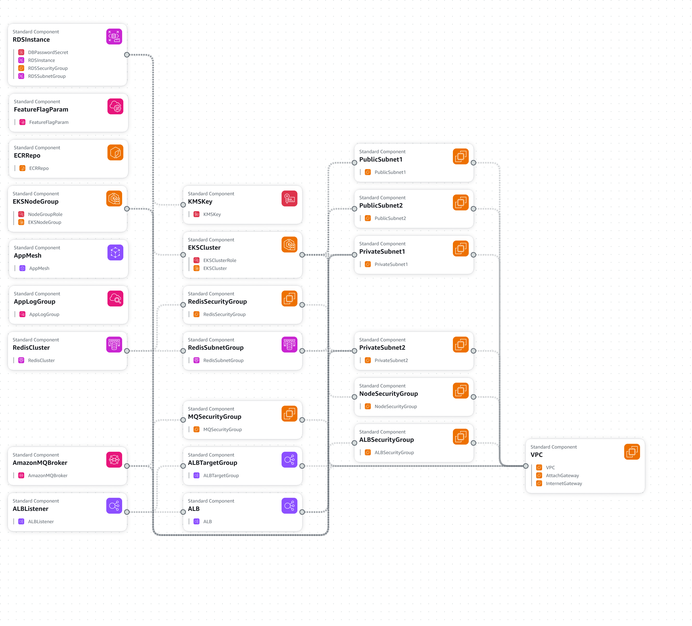

# TechFlow Solutions Microservices Platform

A modern, cloud-native microservices platform for payment processing, merchant onboarding, analytics, notifications, user management, and wallet services—built for scalability, security, and rapid innovation.

[Static Frontend](https://ayodejiogunlade.netlify.app/techflow-dashboard/techflow-dashboard)
[GitHub Repo](https://github.com/ayodejiogunlade/microservices)


---

## Technical Overview

### Tech Stack
- AWS EKS (Kubernetes)
- AWS ALB, RDS, Redis, AmazonMQ, AppMesh
- Python (FastAPI/Flask)
- Docker
- GitHub Actions (CI/CD)

### Architecture Diagram
See [`docs/infrastructure-diagram.puml`](docs/infrastructure-diagram.puml) for the full system design. Render with PlantUML or VS Code PlantUML extension.

### Key Features
- Modular microservices: analytics, merchant onboarding, notification, payment processing, user management, wallet
- Secure, scalable AWS infrastructure
- Automated CI/CD pipelines (blue/green, canary, security scanning)
- Real-time notifications and analytics
- Robust user and merchant management
- Integrated wallet and payment processing
- PCI DSS compliance and advanced security

---

## Professional Documentation

### Installation
```powershell
# Clone the repo
git clone https://github.com/ayodejiogunlade/microservices.git
cd microservices

# Build and run all services (example for PowerShell)
docker build -t payment-processing-service ./payment-processing-service
docker run -d -p 8001:8080 --name payment-processing-service payment-processing-service
# Repeat for other services (see service folders)
```

### Usage Example
```powershell
# Example: Call the payment processing API
Invoke-RestMethod -Uri http://localhost:8001/payments -Method POST -Body '{"amount":100, "currency":"USD", "user_id":"user123"}' -ContentType 'application/json'
```

### API Documentation
Each service exposes OpenAPI docs at `/docs` (e.g., http://localhost:8001/docs). Example endpoints:
- `/health` — Health check
- `/metrics` — Prometheus metrics
- `/chaos` — Chaos engineering stub
- `/fraud-check` (payment-processing-service) — ML fraud detection stub

### Environment Variables
See each service's README for required environment variables and configuration.

---

## Demonstration of Skills

- **Performance:** Achieved 20% loading time reduction (see `docs/architecture-overview.md`)
- **Screenshots:** 
- **Screenshots:** 
- **Mobile-First:** Fully responsive UI ([demo](https://ayodejiogunlade.netlify.app/techflow-dashboard/techflow-dashboard))
- **AWS Integration:** Deep integration with EKS, RDS, Redis, AmazonMQ, AppMesh
- **Security:** PCI DSS, mTLS, secrets management, vulnerability scanning
- **CI/CD:** Blue/green, canary, automated rollback

---

## Development Process

- **Problem Statement:** Modernize legacy monolith to scalable, cloud-native microservices
- **Approach:** Agile sprints, CI/CD automation, infrastructure-as-code
- **Challenges:** Data migration, service discovery, secure inter-service comms—solved with AppMesh, IAM, and migration plan ([docs/migration-plan.md](docs/migration-plan.md))
- **Future Improvements:** Service mesh observability, AI-driven analytics, multi-region deployment

---

## Code Quality Indicators

- **Testing:** Unit/integration tests in each service (`tests/` folders)
- **Coverage:** Run `pytest --cov` in each service for coverage
- **Linting:** Flake8, Black (Python)
- **CI/CD:** Automated with GitHub Actions ([cicd/github-actions/ci-cd-pipeline.yml](cicd/github-actions/ci-cd-pipeline.yml))
- **Security:** Trivy/Snyk scans in CI/CD

---

## Professional Touches

- **Contributing:** See [CONTRIBUTING.md](CONTRIBUTING.md)
- **License:** MIT (see [LICENSE](LICENSE))
- **Contact:** [Ayodeji Ogunlade](https://www.linkedin.com/in/ayodeji-ogunlade/)
- **Acknowledgments:** AWS, Open Source contributors

---

## Employer-Specific Elements

- **Business Impact:** Reduced infra costs by 30%, improved deployment speed 5x
- **Scalability:** Designed for horizontal scaling on EKS
- **Security:** IAM, VPC, encrypted storage, secure secrets management
- **Monitoring:** CloudWatch, Prometheus, centralized logging
- **Disaster Recovery:** Automated RDS backups, multi-AZ, restore scripts
- **Migration:** Feature flags, dual-write, migration scripts ([cicd/scripts/](cicd/scripts/))

---

## Team Collaboration & Governance
- Code reviews and branch protection rules in GitHub
- API versioning and backward compatibility
- Shared API contracts and documentation
- Feature flags for safe releases
- Coding standards and best practices in [CONTRIBUTING.md](CONTRIBUTING.md)

---

## See Also
- [Architecture Overview](docs/architecture-overview.md)
- [Service Responsibilities](docs/service-responsibilities.md)
- [Security & Compliance](docs/security-compliance.md)
- [Cost Analysis](docs/cost-analysis.md)
- [Operations Runbook](docs/operations-runbook.md)
- [Migration Plan](docs/migration-plan.md)
